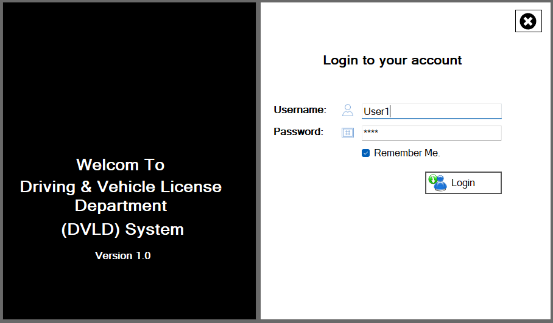
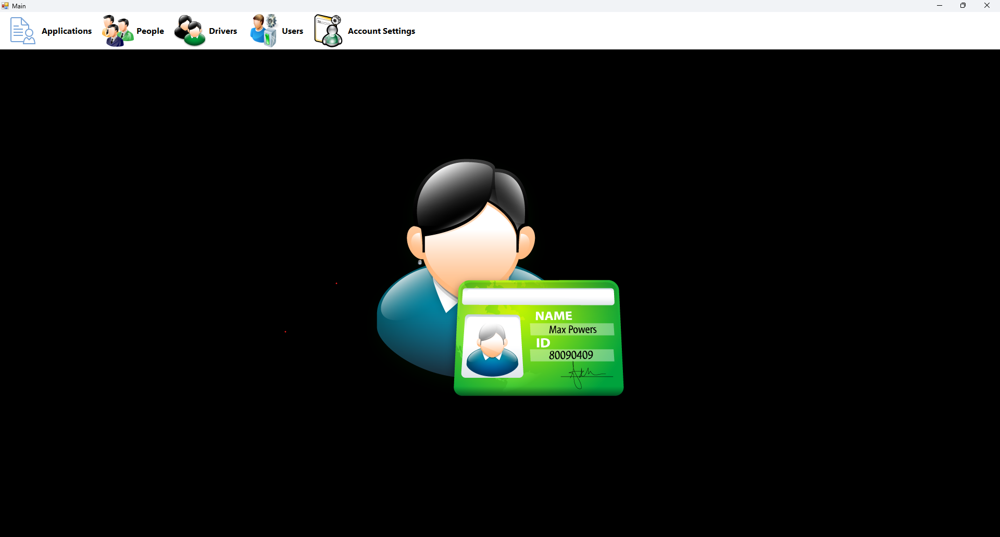
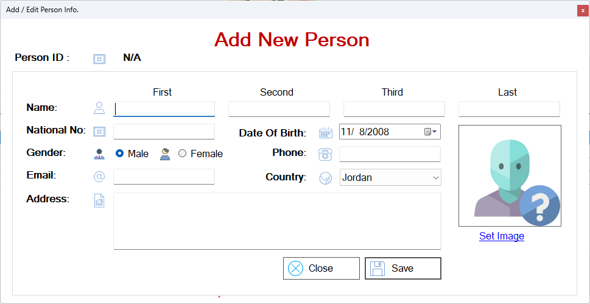
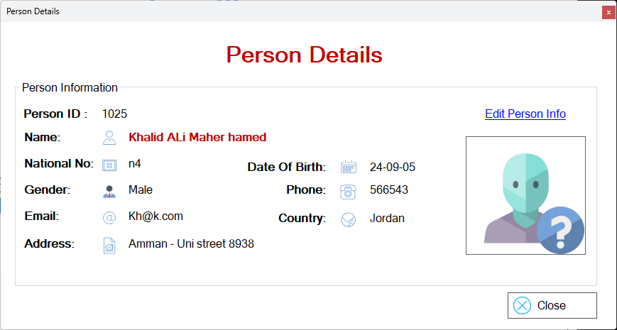
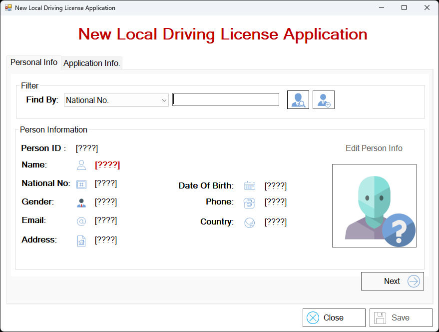
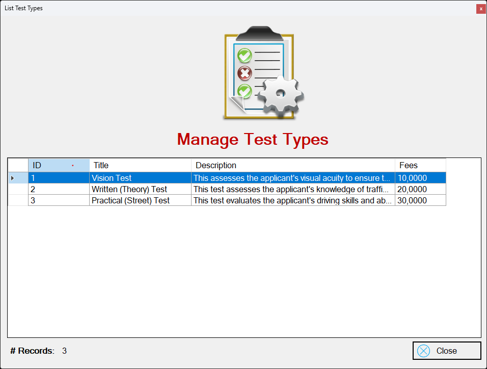
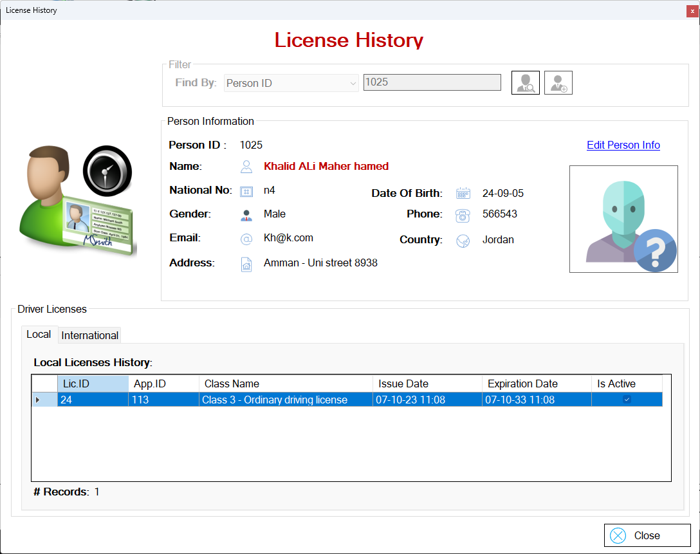
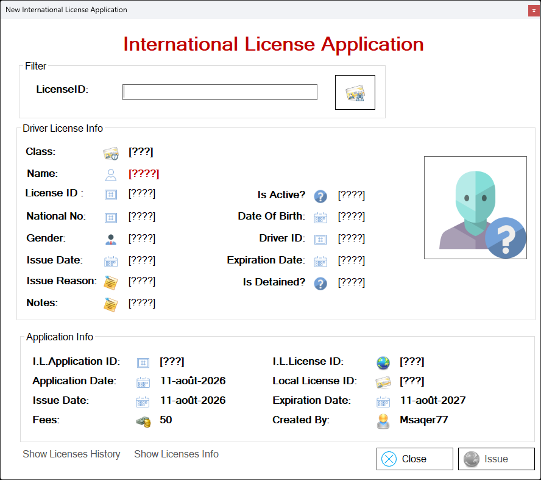
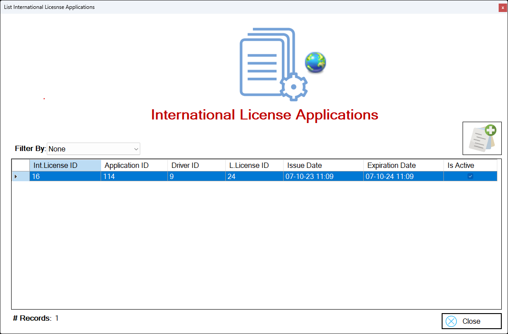
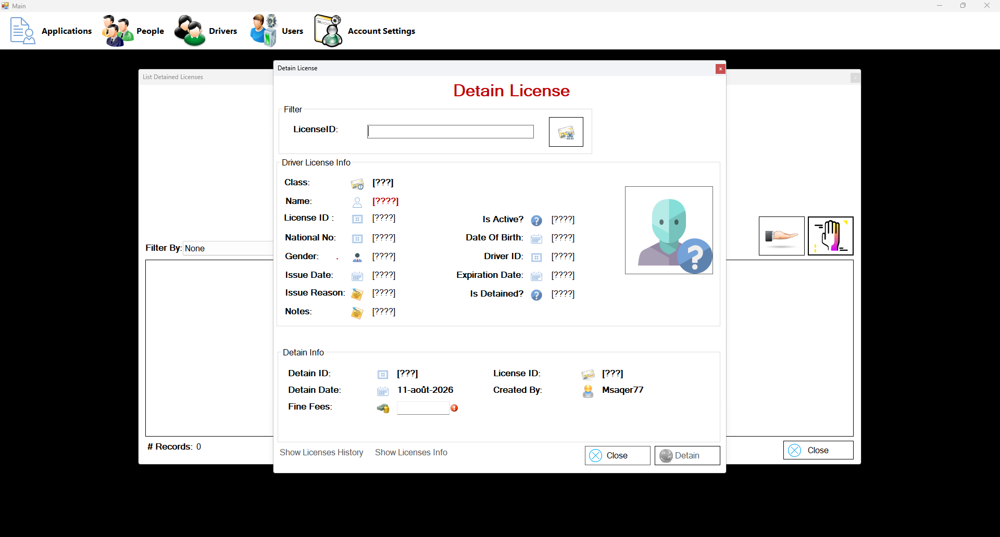

# DVLD (Driving & Vehicle License Department) Management System
A simulated enterprise desktop application for a Driving &amp; Vehicle License Department (DVLD). Built with C#, .NET Windows Forms, ADO.NET, and SQL Server using a 3-tier architecture.

## Project Context
This application was developed as a comprehensive capstone project for the Programming Advices software engineering roadmap. The objective was to simulate a real-world enterprise environment by taking a strict set of provided business requirements and building a fully functional, 3-tier desktop application from scratch.

---

## Overview
The DVLD System is a robust desktop application designed to manage the core operations of a vehicle licensing department. Built using **C#**, **.NET Windows Forms**, **ADO.NET**, and **Microsoft SQL Server**, it strictly follows a **3-Tier Architecture** (Presentation, Business Logic, and Data Access layers) to ensure clean, maintainable, scalable, and decoupled code.

---

## Key Features
*   **Comprehensive Service Management:** Supports 7 primary services including issuing first-time licenses, retaking tests, renewing licenses, replacing lost or damaged licenses, releasing detained licenses, and issuing international licenses.
*   **License Classes:** Manages 7 distinct license classes, ranging from motorcycles and standard cars to commercial taxis, agricultural vehicles, and heavy trucks.
*   **Testing Workflow:** Enforces a strict 3-stage testing process for applicants: Vision Test, Written (Theory) Test, and Practical (Street) Test.
*   **User & Person Administration:** Full CRUD operations for managing system users and citizen profiles, ensuring no duplicate National ID entries.
*   **License Detainment & Release:** A dedicated module to manage infractions, allowing administrators to detain licenses, apply fines, and release them upon payment.
*   **System Configuration:** Dynamic management modules to adjust application fees, test costs, and validity periods without altering the core codebase.

---

## Application Screenshots

### Authentication & Dashboard
> Secure login system and main navigation hub.

### Person Administration
> Managing citizen details, generating unique Person IDs, and preventing duplicate National IDs.

### Licensing & Testing Operations
> Processing new local licenses, managing testing fees, and tracking complete driver histories.

### International Licenses & Detainment
> Issuing international licenses based on active local licenses, and managing license detainment/fines.

---

## Tech Stack & Tools
*   **Language:** C#
*   **Framework:** .NET Framework (Windows Forms)
*   **Database:** Microsoft SQL Server
*   **Data Access:** ADO.NET
*   **Architecture:** 3-Tier Architecture (UI, Business, Data Access) + Object-Oriented Programming (OOP) principles.

---

## Setup & Installation
1. **Database Setup:** 
   * Open SQL Server Management Studio (SSMS).
   * Execute the `.sql` script located in the `Database` folder to generate the schema and populate the essential lookup data (Countries, Test Types, Application Types, etc.).
2. **Application Configuration:**
   * Open the solution (`.sln`) in Visual Studio.
   * Open the `clsDataAccessSettings` file within the main DVLD_DataAccess Layer project.
   * Update the `ConnectionString` to match your local SQL Server instance name.
3. **Run:** Build the solution and start the application.